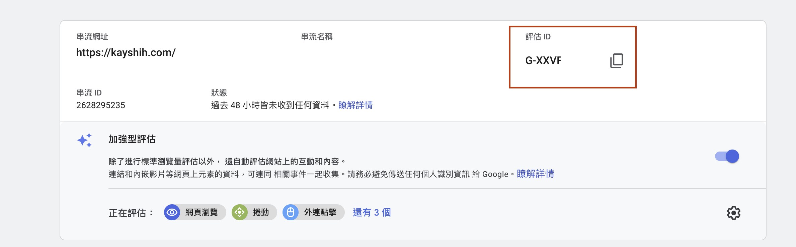
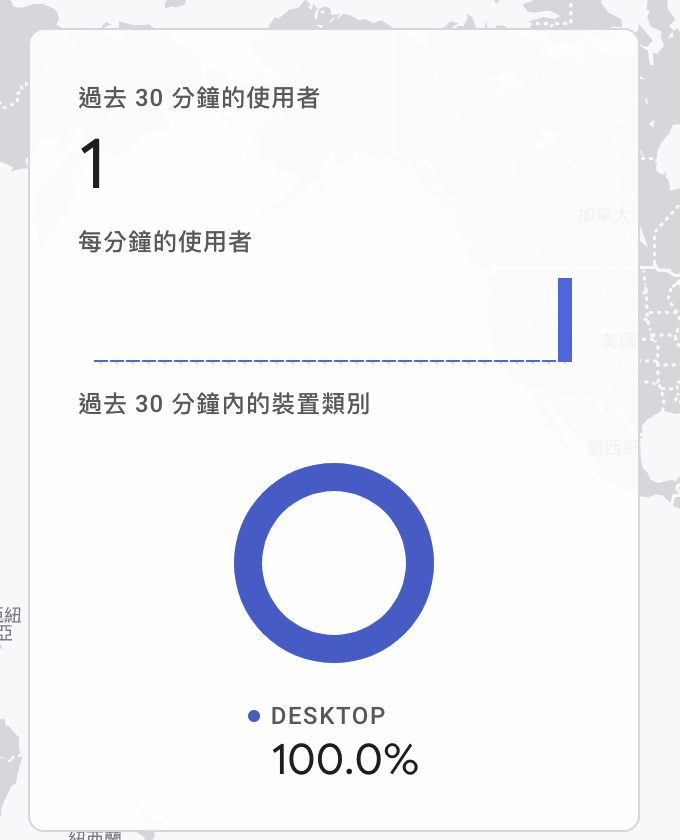
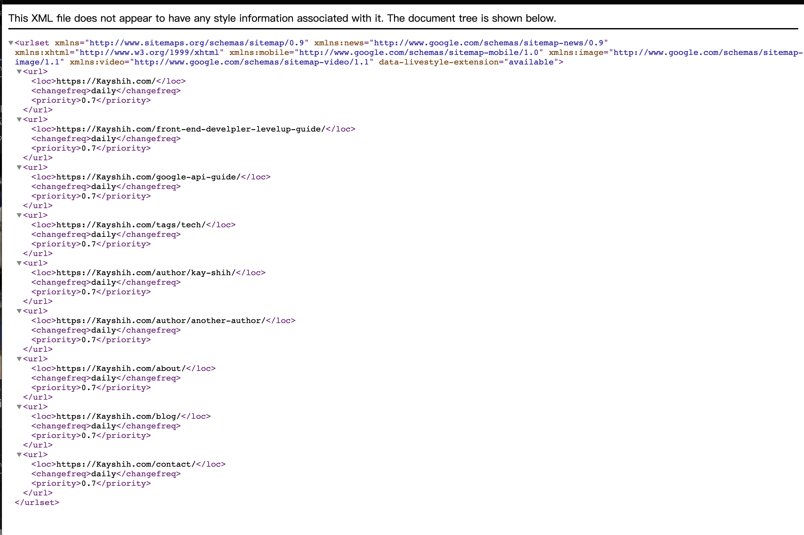

Gatsby 現在已經是建立靜態網站的最佳利器，不管你想要做自己的 Blog 或是電商網站都可以透過 Gatsby 來搭建，這篇文章主要是要教你怎麼在 Gatsby 所建立的網站上快速加上 GA 以及生成 sitemap.xml

---

其實 Gatsby 都已經有現成的 plugin 能讓開發者直接插入 GA 以及生成 sitemap，我們就來直接安裝這兩個套件吧

## gatsby-plugin-google-gtag

這個套件不只能讓你埋 GA 也同時支援其他 google 的廣告分析，那我們這邊只介紹 GA 的部分。
首先先去申請 GA，然後拿到一組 TrackingIds


```
  yarn add gatsby-plugin-google-gtag
```

```
  // gatsby-config.js

  plugins: [
    {
      resolve: `gatsby-plugin-google-gtag`,
      options: {
        trackingIds: [
          'G-XXXXXXX', // Your trackingId
        ],
        pluginConfig: {
          head: true, // 要將script埋在header中的話記得要改成true
        },
      },
    },
  ]
```

這個套件只在 production 模式下才會作用，所以要看到效果的話記得要 build 完再測試

```
    gatsby build && gatsby server
```

接著進去網站看看 ，然後過個 1 ~ 2 分鐘再到 GA 頁面看如果使用者人數有變動那就是成功了。



## gatsby-plugin-sitemap

Sitemap 是為了讓 Google 爬蟲來讀取，並幫助搜尋引擎知道你的網站有哪些頁面，進而優化 SEO，如果是傳統作法 sitemap 可能要透過其他工具生成或是自己做，
但現在只要透過 gatsby 這個套件就能幫你自己產生啦。

```
  yarn add gatsby-plugin-sitemap
```

```
  // gatsby-config.js

module.exports = {
  siteMetadata: {
    siteUrl: 'https://example.com',
  },
  plugins: [
    'gatsby-plugin-sitemap',
  ]
```

接著打開 https://example.com/sitemap.xml 看到這份 xml 文件就是生成成功了



Gatsby 真的是非常強大的網站生成框架，只要你對 react & graphql 有點基礎或是想學習這兩個技術，都推薦使用來進行開發，那我之後也會發更多關於 Gatsby 使用上的教學跟心得。

---

有任何技術問題想要交流或是前端學習上遇到困難都歡迎直接透過 instagram 訊息我 [@kayshih.dev](https://www.instagram.com/kayshih.dev)

---
