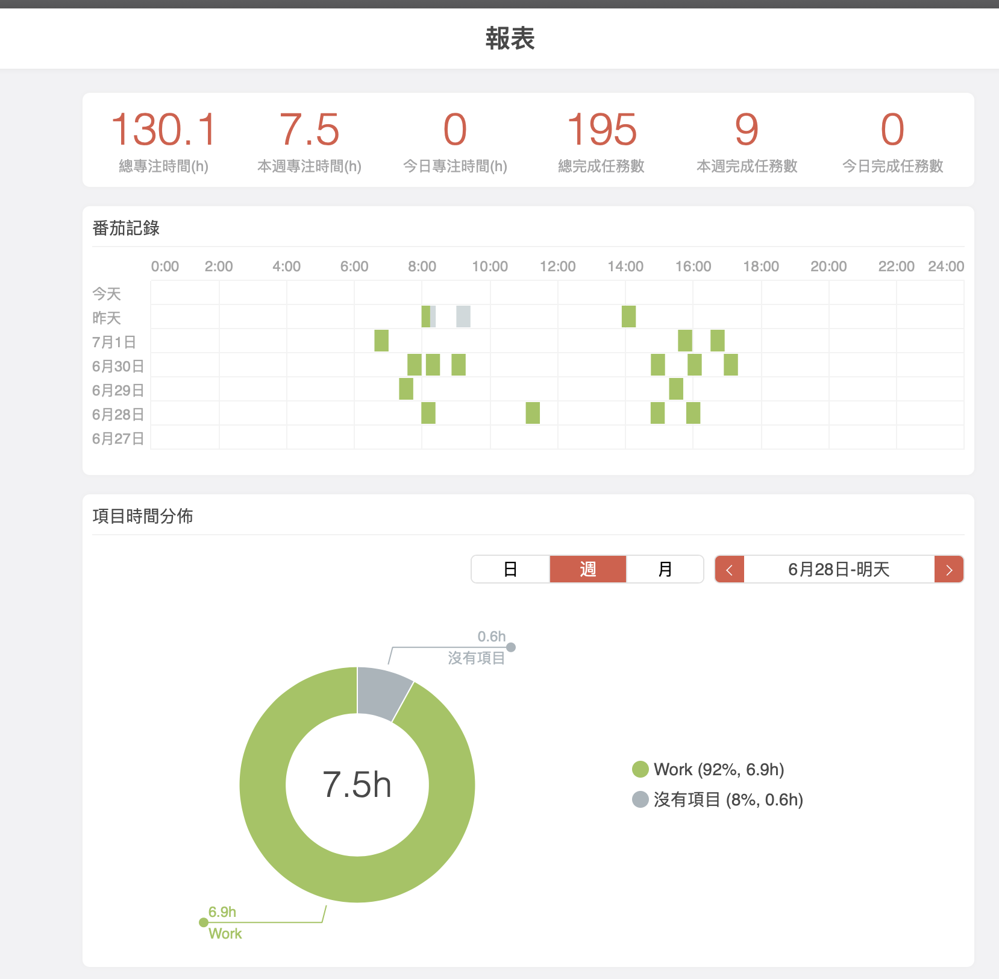

工程師在開發專案開始時，最常被問的問題一定是，這項功能你需要多久的時間？

對於工程師來說評估時間真的是一項藝術，因為開發過程你不知道會遇到什麼的坑，導致開發時間拉長或是把功能想得太簡單，結果時間估的過長。

分享我自己都是怎麼去評估開發時間以及提升自己的生產力

---

# 估番茄數

1. 將大功能拆分成多個小功能 & 衡量每個功能的複雜度
2. 針對每個小功能去評估需要多少顆蕃茄

# 做紀錄

那可能有些情況發現切出來的功能居然花不到一顆蕃茄鐘的時間，這種情形可能就要思考是不是把功能切分得太細了，所以做紀錄非常重要
剛開始評估的時候多少都會不準，每次都要記錄自己實際用了幾顆蕃茄(實際開發時間)跟預估番茄數(預估開發時間)，多次進行跟修正之後，我現在評估功能開發時辰的準確性，頂多落差一兩顆蕃茄。

使用蕃茄鐘的好處不僅可以清楚知道自己一天到底花了多少時間在實際開發上，同時也可以避免拖延症，劃掉每一項待辦事項的感覺很也爽。

# APP 推薦

### [專注清單]("https://apps.apple.com/tw/app/id1258530160")

我自己是使用這款 APP，它同時有代辦事項的功能加上蕃茄鐘，還會產出報表讓你知道自己的時間都花去哪邊。

### [Toggl Track]("https://toggl.com/track/")

這款 App 會紀錄你做每一項事情的時間，建議安裝電腦版，這樣當你開著的時候它會自動幫你記錄目前在使用哪個軟體，每天都可以看到自己時間到底浪費在哪裡。

---

有任何技術問題想要交流或是前端學習上遇到困難都歡迎直接透過 instagram 訊息我 [@kayshih.dev](https://www.instagram.com/kayshih.dev)

---
